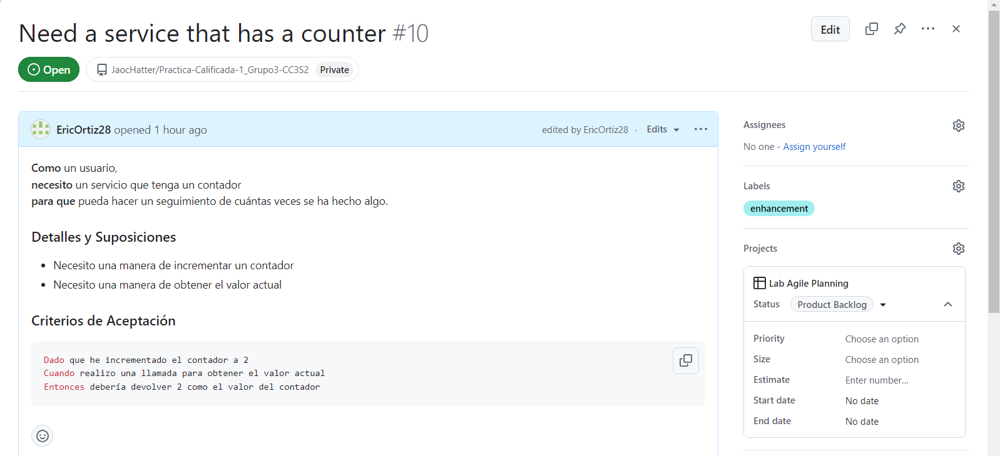

# Actividad: Gestión ágil de proyectos con GitHub Projects: Configuración de Kanban Board y Creación de Historias de Usuario

**Parte 1**
En este ejercicio, aprenderás cómo configurar un Kanban board usando GitHub Projects para el repositorio del curso.

>Creamos nuestro proyecto y le pusimos el nombre de Lab Agile Planning.

>Modificamos los nombres de las columnas.

>Agregamos algunas columnas y finalmente quedó de esta manera.

**Parte 2**
En este ejercicio, crearás una issue template en GitHub que te ayudará a escribir historias de usuario bien formateadas en el Kanban board.

>Se creó una plantilla de issue en GitHub seleccionando las configuraciones del repositorio, configurando las plantillas, eligiendo una plantilla personalizada, y editándola con el contenido necesario en formato markdown.

>El resultado final se termina viendo así, con una plantilla de issue personalizada en GitHub que incluye campos como "name", "about", "title", "labels", y "assignees", además de una estructura para detalles y criterios de aceptación en formato markdown.

**Parte 3**

En este ejercicio crearás siete historias de usuario basadas en los requisitos dados. Las primeras cuatro se te proporcionarán. Solo tendrás que copiarlas y pegarlas para familiarizarte con la creación de historias de usuario en GitHub. Deberás crear las últimas tres historias de usuario por ti mismo.Luego priorizarás estas historias y las moverás a las columnas apropiadas en tu Kanban board.

**1: Crear nuevas historias de usuario usando GitHub issues**

1. Ve a la pestaña Issues del repositorio del curso o donde estés trabajando la actividad.

2. Haz clic en el botón New issue.

3. Verás tu template listada aquí. Haz clic en el botón Get Started.

4. Introduce el título para la primera historia como Need a service that has a counter y actualiza la sección de historia de usuario (es decir, As a, I need, So that) por ahora. Una vez hecho, haz clic en el botón Submit new issue.

5. Tu primera historia de usuario ahora está creada.

6. Agregar la historia de usuario creada al Kanban board, haz clic en el botón de configuración al lado de la opción Projects, y luego elige el proyecto Lab Agile Planning del menú desplegable que creaste en el ejercicio anterior.

7. A continuación, selecciona el menú desplegable Status y elige New Issues. Esta acción moverá la historia de usuario creada a la columna 'New Issues' en el Kanban board.

8. Para ver la historia de usuario recién creada en el Kanban board, navega a la pestaña Projects y selecciona el proyecto titulado Lab Agile Planning.

9. Notarás que la historia de usuario recién creada ahora está listada bajo la columna New Issues.

10. Dado que debemos crear un total de siete historias de usuario, ajustemos el límite predeterminado a 7. Para lograr esto, haz clic en los tres puntos de la columna New Issues, luego selecciona la opción Set limit.

11. Introduce el límite como 7 en el campo de texto Column limit y haz clic en Save. Ten en cuenta que, similar a esto, puedes optar por modificar los límites de otras columnas o mantener los límites predeterminados.

12. Para regresar a la pestaña Issues para crear nuevas historias de usuario, simplemente haz clic en el botón de retroceso del navegador.

13. Continúa agregando historias hasta que las siete estén creadas y tu Kanban board se parezca a la captura de pantalla mostrada a continuación. Las primeras cuatro historias se proporcionan en la lección. Deberás crear tu propio rol, función y beneficio para las últimas tres historias.

>Las primeras cuatro historias:

>las últimas tres historias:

>Finalmente estas con las siete historias:

**Ejercicio: Priorizar el product backlog**

En este ejercicio, moverás issues entre columnas para recrear el Kanban board del video de la lección **Building the Product Backlog.** Esto simulará un punto de partida inicial para nuestro próximo laboratorio sobre la refinación del backlog. Ten en cuenta que puedes mover los issues entre columnas simplemente arrastrándolos y soltándolos de una columna a otra.

1. Mueve la historia **Need a service that has a counter** al inicio de la columna **Product Backlog**.
2. Mueve la historia **Must allow multiple counters** a la columna **Icebox.**
3. Mueve la historia **Must persist counter across restarts** al final de la columna **Product Backlog.**
4. Mueve la historia **Counters can be reset** al final de la columna **Product Backlog.**
5. Deja las historias restantes en la columna **New Issues** por ahora. Las moveremos en un laboratorio posterior.

**Parte 4**

En este ejercicio, seguirás los pasos para llevar a cabo una reunión de refinamiento del backlog.Serás el product owner preparando el product backlog para tu próxima reunión de planificación del sprint. Esto implica preparar las historias que creamos en el último ejercicio para hacerlas listas para el sprint.

**1: Triage de nuevos issues**

En este ejercicio, tomarás todas las historias en la columna **New Issues** y las moverás a una columna apropiada o las rechazarás.

1. Ve a github.com e inicia sesión con tu cuenta de GitHub y abre tu Kanban board.
2. El primer nuevo issue es **Deploy service to the cloud.** Queremos hacer eso después de agregar persistencia, así que muévelo a la columna **Product Backlog** bajo **Must persist counter across restarts.**

3. El siguiente nuevo issue es **Need the ability to remove a counter.** Solo tenemos un contador y no quisiéramos eliminarlo, así que muévelo al **Icebox** después de **Must allow multiple counters.**

4. El último nuevo issue es **Need ability to update a counter to a new value.** Podríamos querer hacerlo como una mejora después de poder reiniciar el contador, así que muévelo al **Product Backlog** después de **Counters can be reset.**

Ahora has completado el triage de nuevos issues y puedes comenzar a hacer que las historias en la columna **Product Backlog** estén listas para el sprint.

**2: Hacer que las historias estén listas para el sprint**

En este parte, agregarás más detalles a las historias en el **Product Backlog** que creas que podrían entrar en el próximo sprint. Se te proporcionarán los detalles para dos de las historias. Debes proporcionar los detalles para las otras tres.

1. Selecciona la primera historia en la parte superior de la columna **Product Backlog** para abrirla. Haz clic en los tres puntos y luego selecciona el botón **Edit** para editar el issue.

2. Edita los **Details y Assumptions** para que los desarrolladores sepan lo que sabemos, y edita los **Acceptance Criteria** para asegurar que todos entiendan cuál es la definición de "hecho". Haz que tu historia se vea como esta:

3. Cuando termines de editar, presiona el botón Save para guardar las ediciones.
4. Cierra la ventana presionando el icono de X.

5. Edita la historia **Must persist counter across restarts** de la misma manera.

6. Edita las siguientes historias con tus propios detalles, suposiciones y criterios de aceptación:
• Deploy service to the cloud
• Counters can be reset
• Need ability to update a counter to a new value 

Al completar este ejercicio, tu Kanban board debería tener suficientes detalles en todas las historias del **Product Backlog** para hacerlas listas para el sprint.

**3: Crear nuevas labels en GitHub**

En este ejercicio, crearás una nueva **label** en GitHub llamada **technical debt** para marcar aquellas historias que no aportan valor visible al cliente pero deben completarse para continuar con el desarrollo.

1. Desde la página de tu repositorio, selecciona la pestaña **Issues.**

2. Desde la página de issues, selecciona el botón **Labels.**

3. Desde la página de labels, selecciona el botón **New label.**

4. En la sección de nueva **label**: (1) establece el nombre de la **label** como **technical debt**, (2)
establece el Color como amarillo (#FBCA04), y luego (3) presiona el botón **Create label.**

5. Ahora deberías ver una label amarilla technical debt que podemos usar para anotar
nuestras historias.

**4: Añadir labels a las historias**

En este ejercicio, añadirás **labels** a las historias en el **Product Backlog** para hacerlas aún más listas para el sprint. También usarás nuestra nueva **label** llamada **technical debt** para marcar aquellas historias que no aportan valor visible al cliente pero deben completarse para continuar con el desarrollo.

1. Selecciona la primera historia en la parte superior de la columna **Product Backlog** para abrirla. Luego, presiona el icono de engranaje al lado de **Labels** para asignar una **label.**

2. Nuestra primera historia es una mejora a nuestro producto. Desde el menú de *labels**, selecciona *enhancement** para reflejar eso.

3. Haz clic en cualquier parte fuera del menú de **labels** para cerrarlo. Ahora deberías ver que la **label enhancement** ha sido asignada a esta historia.

4. Selecciona cada una de las siguientes historias en la columna Product Backlog y asígnales las labels correspondientes:

* Story Title: **Must persist counter across restarts** Label: enhancement

* Story Title: **Deploy service to the cloud** Label: technical debt

* Story Title: **Counters can be reset** Label: enhancement

* Story Title: **Need ability to update a counter to new value** Label: enhancement

