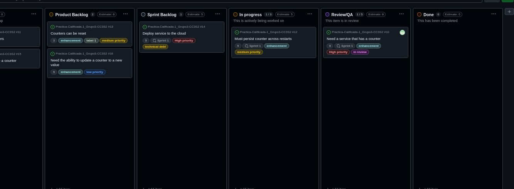

# Actividad: Gestión ágil de sprints con GitHub: planificación, ejecución y cierre de Sprints.

**1: Configuración de Sprints**
En este ejercicio, configurarás tus sprints. GitHub configurará tres (3) sprints de forma predeterminada para que puedas comenzar. Luego, creará nuevos sprints automáticamente según sea necesario.

1. Ve a GitHub, inicia sesión con tu cuenta de GitHub, y abre tu Kanban board.
2. Para crear el sprint, haz clic en el botón desplegable junto a Backlog. Luego, haz clic en la flecha derecha junto a Fields y selecciona New field.

3. Aparecerá una ventana emergente. Introduce "Sprint" como el nombre del campo, elige "Iteration" como el tipo de campo, y deja la fecha de inicio en la fecha actual. Mantén la duración en dos semanas. Finalmente, haz clic en el botón Save and create.

4. Ahora tienes un sprint que se puede usar para la planificación del sprint en el próximo ejercicio.

**2: Crear un plan Sprint**
En este ejercicio, crearás un sprint plan. Asignaremos puntos de historia estimados y un sprint, y moveremos las historias del Product Backlog al Sprint Backlog para construir nuestro plan.

1. Selecciona la historia superior "Need a service that has a counter" del Product Backlog para abrirla.

2. Discutiste la historia con el equipo, y tus desarrolladores están de acuerdo en que esta es una historia grande que vale 8 puntos de historia, así que establece el Estimate en 8.

3. Haz clic en "Choose an iteration" junto a Sprints y selecciona el primer sprint de la lista desplegable para asignar la historia a ese sprint. Puedes asignar una historia a más de un sprint, pero esto no es muy ágil. Si tu historia es más grande que un sprint, entonces es demasiado grande y debe dividirse en historias más pequeñas "del tamaño de un sprint".

4. Tu historia debería verse como la siguiente. Haz clic en la "X" para cerrar la ventana de la historia y volver al Kanban board.

5. El equipo de desarrollo ha determinado que agregar una historia de 8 puntos al sprint es aceptable. Arrastra la historia del Product Backlog al Sprint Backlog.
**Nota:** Puedes ver las fechas de inicio y fin de la historia de usuario pasando el ratón sobre el Sprint que se muestra en la tarjeta.

6. Tu Kanban board debería verse ahora como el siguiente. Observa que la estimación de puntos de historia y las fechas del sprint son anotaciones en la historia.

7. La reunión de planificación del sprint ha avanzado bien. En las discusiones con el equipo de desarrollo, han estimado las siguientes dos historias en el Product Backlog y han determinado que ambas pueden caber en el sprint actual. Selecciona cada una de las siguientes historias en el Product Backlog, asígnales los puntos de historia correspondientes y el mismo Sprint, y arrástralas al Sprint Backlog en el mismo orden.

Título de la Historia Puntos de Historia

 Must persist counter across restarts 5
 Deploy service to the cloud 5

Al final de este paso, tu sprint plan debería verse así:

8. Basado en la velocidad del equipo, el equipo de desarrollo ha decidido que hay suficientes historias en el sprint, pero queda tiempo para estimar más historias durante la reunión de planificación. A continuación, se añaden las siguientes estimaciones a las historias en el Product Backlog:

| Historia | Estimación |
| -------- | ---------- |
| Counters can be reset | 3 puntos |
| Need ability to update a counter to new value | 5 puntos |

---

## **Parte 2: Flujo de Trabajo Diario en el Sprint**

En este ejercicio, seguirás el flujo de trabajo diario de un desarrollador ágil, donde moverás historias del Sprint Backlog a "In Progress", las asignarás a ti mismo, las pasarás a "Review/QA" y finalmente a la columna "Done". 

**Objetivos del Ejercicio**
- Asignar historias a ti mismo.
- Mover historias a "In Progress".
- Solicitar una revisión moviendo historias a "Review/QA".
- Marcar historias como completadas en la columna "Done".

### **Flujo de Trabajo Diario**

1. **Inicio del Sprint**  
   Inicia sesión en GitHub y abre tu Kanban board. El sprint ha comenzado y es hora de trabajar en tu primera historia. Selecciona la historia en la parte superior del Sprint Backlog, asígnatela y muévela a la columna "In Progress". 

2. **Avance de la Historia**  
   Una vez asignada, cierra la ventana y arrastra la historia del Sprint Backlog a "In Progress". Asegúrate de que tu Kanban board se vea como la imagen a continuación:  

3. **Revisión y QA**  
   Después de terminar de trabajar en la historia, muévela de "In Progress" a "Review/QA" para solicitar una revisión.  

4. **Comienza una Nueva Historia**  
   Mientras esperas la revisión, toma la siguiente historia del Sprint Backlog, asígnatela y muévela a "In Progress".  

5. **Completa la Historia Inicial**  
   Una vez aprobada tu revisión, mueve la historia "Need a service that has a counter" de "Review/QA" a "Done".  

6. **Segunda Historia a Revisión**  
   Mueve la historia "Must persist counter across restarts" de "In Progress" a "Review/QA" para solicitar una revisión.  

7. **Continúa con el Trabajo**  
   Asigna la última historia, "Deploy service to the cloud", y muévela a "In Progress".  

8. **Cierre del Sprint**  
   La revisión de la segunda historia se ha completado. Mueve la historia "Must persist counter across restarts" a "Done".  

   **Estado Final del Sprint:**  
   El sprint ha terminado, pero la historia "Deploy service to the cloud" aún está en progreso. El Kanban board final debería verse así: 

---

## **Parte 3: Configuración de un Burndown Chart**

Un burndown chart te ayuda a monitorear el progreso de tu sprint, mostrando el trabajo restante versus el tiempo disponible. En esta sección, aprenderás a configurar un burndown chart en GitHub.

### **Pasos para Configurar el Burndown Chart**
1. **Generar Gráfico**  
   Ve a tu Kanban board en GitHub, selecciona el menú desplegable al lado de "Backlog" y elige "Generate chart".  

2. **Aplicar Filtro**  
   Filtra las historias que están en la columna "Done" para centrarse en el trabajo completado.  

3. **Configurar el Gráfico**  
   Personaliza el gráfico con las siguientes opciones:
   - **Layout:** "Column"
   - **X-axis:** "Sprint"
   - **Group by:** "Status"
   - **Y-axis:** "Sum of a field"
   - **Y-axis field:** "Estimate"

4. **Filtrar por Sprint**  
   Añade el filtro "sprint: Sprint 1" para centrarse en las historias de este sprint. 

5. **Visualización de Progreso**  
   Pasa el ratón sobre las columnas para ver los puntos completados y restantes. 

---

## **Parte 4: Cierre del Sprint y Gestión del Backlog**

En este ejercicio práctico, aprenderás cómo gestionar las historias no terminadas, ajustar los **story points** y preparar el backlog para el próximo sprint. Es importante documentar la deuda técnica y mover las historias completadas a "Done" para asegurar una transición fluida entre sprints.

### **Objetivos del Ejercicio:**
- Ajustar los **story points** de las historias incompletas para reflejar el esfuerzo realizado.
- Mover las historias completadas a la columna **"Done"**.
- Crear nuevos issues para documentar el trabajo pendiente.
- Organizar el **Product Backlog** para priorizar las tareas del próximo sprint.

### **Pasos para el Cierre del Sprint:**

1. **Ajustar los Story Points de la Historia Incompleta**

   Selecciona la historia **"Deploy service to the cloud"** en la columna **"In Progress"**. Ajusta los **story points** a **2**, reflejando el esfuerzo realizado hasta ahora.  

   Haz clic en la opción **"Estimate"** y ajusta los **story points** a **2**.

2. **Mover la Historia Incompleta a "Done"**

   Una vez ajustada la estimación, mueve la historia **"Deploy service to the cloud"** a la columna **"Done"** para indicar que ya se ha registrado el progreso alcanzado en este sprint. 

3. **Crear un Nuevo Issue para Documentar el Trabajo Restante**

   Regresa a tu repositorio de GitHub y navega a la pestaña **Issues**. Haz clic en **"New Issue"** para crear un nuevo issue. Selecciona la **User Story Template** para mantener la coherencia en la documentación.

   **Instrucciones:**
   - Completa el título y la descripción del issue, explicando claramente que representa el trabajo restante para la historia **"Deploy service to the cloud"**.
   - Asigna la etiqueta **"technical debt"**.
   - Establece el proyecto a **"Lab Agile Planning"**.
   - En el campo de estimación, asigna **3 story points**, que corresponden al trabajo restante.

   Finalmente, haz clic en **"Submit new issue"** para guardar el issue.

4. **Mover el Nuevo Issue al Product Backlog**

   Asegúrate de que el nuevo issue creado esté ubicado en la columna **"Product Backlog"**. Para ello, abre el menú desplegable junto a la opción **"Status"** y selecciona **"Product Backlog"**. Establece el estimado de **3 story points**.  

5. **Priorizar el Backlog**

   Mueve la nueva historia a la parte superior de la columna **"Product Backlog"** para que esté lista para ser seleccionada en el próximo sprint. Esto garantizará que el equipo se enfoque en completar el trabajo pendiente desde el inicio de la próxima iteración.  

### **Resultado Final**

Al finalizar este ejercicio, habrás ajustado los **story points** de las tareas incompletas, documentado el trabajo pendiente y organizado el backlog para el próximo sprint. De este modo, se mejora la continuidad y eficiencia del equipo en la gestión del proyecto. Dominar estas actividades de cierre de sprint es esencial para agilizar las transiciones entre sprints y asegurar que todo el trabajo esté correctamente contabilizado.

---

