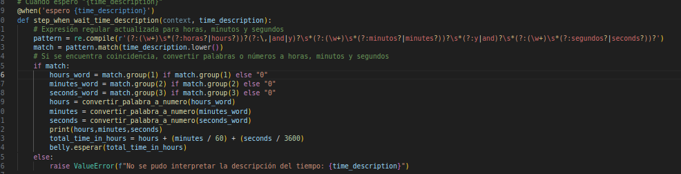
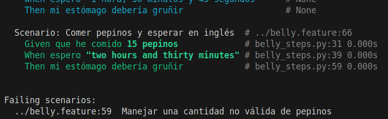

# Actividad 10
Actividad: BDD con Behave y Gherkin
El código y estas historias de usuario, junto con los criterios de aceptación, están implementados en
el repositorio de GitHub: kapumota/CC3S2 en la semana 4 en un proyecto llamado: "belly_project"

El código proporcionado implementa una serie de pruebas usando Behavior-Driven Development
(BDD) con la herramienta Behave, y describe diferentes escenarios de comportamiento utilizando el
lenguaje Gherkin. El enfoque de BDD se centra en alinear el desarrollo de software con los
requerimientos del negocio, expresados como historias de usuario. En el proyecto, los escenarios
giran en torno a la simulación de comer pepinos y esperar un tiempo determinado para verificar si el
estómago gruñe.

### Estas fueron las correciones para que el programa ejecute todos los test correctamente:
1. Traducción del castellano al inglés:
Existen algunas palabras claves que deben estar en Castellano 

2. Detalles en la lógica:
Se encontró algunos errores en el código que no permitian que el comando "behave" las analizara correctamente. 

3. Lógica de Belly.py
En el código "belly_steps.py" se declara a belly como una variable global, lo que hacia según la lógica "Belly.py" cada actualizacion de la cantidad de pepinos como de tiempo se actualizara. 

---
## Nuevos casos:
### Feature: Característica del Estómago Extendida

Se añadieron los siguientes escenarios. 

La solución fue añadir el siguiente patrón para la función con etiqueta "Give", extender el diccionario de números con nuevos casos y preever nuevos errores de conversión de string a tipo **int**. 

### Feature: Descripciones de tiempo complejas
Ampliar la lógica para manejar descripciones de tiempo complejas. 

La solución fue modificar el patrón. 

### Feature: Validación de cantidades no válidas
Manejar casos en los que se ingresen cantidades no válidas de pepinos (muy altas o negativas). 
 

La solución fue refactorizar la clase "Belly", en la función comer para ser más específicos, añadiendo "Assertion Flags". 
 
Resultados:
 

### Feature: Manejo de diferentes lenguajes
Añadir soporte para diferentes idiomas, como inglés. 
 
Para esto será util añadir un diccionario de números en inglés y modificar los grupos para que estas tengan alternativas. 
 
Resultados: 
                

